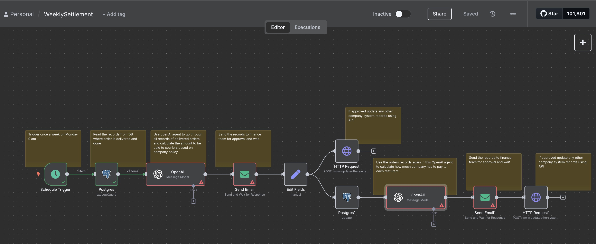

<!DOCTYPE html>
<html lang="en">
<head>
  <meta charset="UTF-8">
  <title>Food Delivery Automation Workflows (n8n)</title>
</head>
<body>
  <h1>Food Delivery Automation Workflows (n8n)</h1>

  
This repository contains two complete automation workflows built in <strong>n8n</strong> for a food delivery platform. The workflows are designed to support core financial operations related to <strong>courier settlements</strong> and <strong>customer refunds</strong>, based strictly on internal company policy.

  

  <h2>📦 1. WeeklySettlement Workflow</h2>
  
This workflow runs automatically <strong>every Monday at 9:00 AM</strong> and calculates settlement payments owed to <strong>couriers</strong> and <strong>restaurants</strong> based on delivery performance.

  <h3>🔁 Logic Summary:</h3>
  <ul>
    <li>Fetches all <strong>delivered orders from the past 7 days</strong>.</li>
    <li>Uses OpenAI to:
      <ul>
        <li>Calculate delivery fee based on distance:
          <ul>
            <li>&lt; 5 km → $2</li>
            <li>5–7 km → $3</li>
            <li>≥ 7 km → $5</li>
          </ul>
        </li>
        <li>Determine if couriers made more than 5 deliveries in the same hour (which increases their share from 60% to 65%).</li>
      </ul>
    </li>
    <li>Calculates:
      <ul>
        <li><code>courier_amount</code></li>
        <li><code>company_amount</code></li>
      </ul>
    </li>
    <li>Sends the full breakdown to <strong>finance for approval</strong>.</li>
    <li>Once approved:
      <ul>
        <li>Updates internal database with courier payouts.</li>
        <li>Uses OpenAI again to calculate <strong>per-restaurant payout</strong> based on a flat rate of <code>$20/order</code>.</li>
        <li>Sends restaurant payouts for finance approval and pushes data to external systems via API.</li>
      </ul>
    </li>
  </ul>

  <h3>🖼 Workflow Screenshot:</h3>
  

  

  <h2>🔁 2. RefundCustomers Workflow</h2>
  
This workflow is triggered <strong>manually or at frequent intervals</strong> to process <strong>cancelled orders</strong> and issue refunds.

  <h3>🔁 Logic Summary:</h3>
  <ul>
    <li>Pulls all orders with <code>order_status = 'Cancelled'</code>.</li>
    <li>Sends the list to <strong>finance for manual approval</strong>.</li>
    <li>Upon approval:
      <ul>
        <li>Uses a <code>Switch</code> node to determine whether the payment was made via:
          <ul>
            <li>App Wallet → Refund is issued by updating wallet balance.</li>
            <li>Credit Card → Refund is issued through an API call to the card provider.</li>
          </ul>
        </li>
        <li>Confirms refund was successful.</li>
        <li>Updates the database to reflect the refunded status and customer balance.</li>
      </ul>
    </li>
  </ul>

  <h3>🖼 Workflow Screenshot:</h3>
  

  

  <h2>📁 Files Included</h2>
  <table border="1" cellpadding="6">
    <tr><th>File</th><th>Description</th></tr>
    <tr><td><code>WeeklySettlement.json</code></td><td>n8n export for the courier/restaurant weekly payout automation</td></tr>
    <tr><td><code>RefundCustomers.json</code></td><td>n8n export for the customer refund workflow</td></tr>
    <tr><td><code>WeeklySettlements.jpg</code></td><td>Visual diagram of the WeeklySettlement flow</td></tr>
    <tr><td><code>RefundCustomers.jpg</code></td><td>Visu
