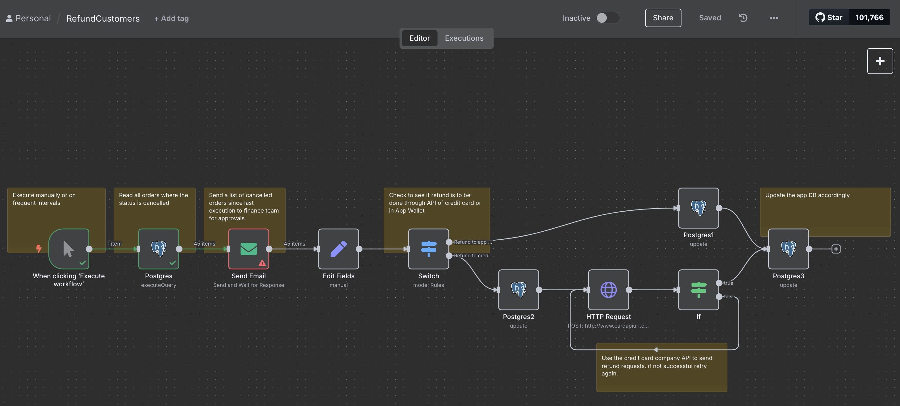

<!DOCTYPE html PUBLIC "-//W3C//DTD HTML 4.01//EN" "http://www.w3.org/TR/html4/strict.dtd">
<html>
<head>
  <meta http-equiv="Content-Type" content="text/html; charset=utf-8">
  <meta http-equiv="Content-Style-Type" content="text/css">
  <title></title>
  <meta name="Generator" content="Cocoa HTML Writer">
  <meta name="CocoaVersion" content="2299.77">
  
</head>
<body>

# Food Delivery Automation Workflows (n8n)

 

This repository contains two complete automation workflows built in **n8n** for a food delivery platform. The workflows are designed to support core financial operations related to **courier settlements** and **customer refunds**, based strictly on internal company policy.

 

---

 

## 📦 1. WeeklySettlement Workflow

 

This workflow runs automatically **every Monday at 9:00 AM** and calculates settlement payments owed to **couriers** and **restaurants** based on delivery performance.

 

### 🔠Logic Summary:

- Fetches all **delivered orders from the past 7 days**.

- Uses OpenAI to:

  - Calculate delivery fee based on distance:

    - &lt; 5 km → $2

    - 5–7 km → $3

    - ≥ 7 km → $5

  - Determine if couriers made more than 5 deliveries in the same hour (which increases their share from 60% to 65%).

- Calculates:

  - `courier_amount`

  - `company_amount`

- Sends the full breakdown to **finance for approval**.

- Once approved:

  - Updates internal database with courier payouts.

  - Uses OpenAI again to calculate **per-restaurant payout** based on a flat rate of `$20/order`.

  - Sends restaurant payouts for finance approval and pushes data to external systems via API.

 

### 🖼 Workflow Screenshot:

 

---

 

## 🔠2. RefundCustomers Workflow

 

This workflow is triggered **manually or at frequent intervals** to process **cancelled orders** and issue refunds.

 

### 🔠Logic Summary:

- Pulls all orders with `order_status = 'Cancelled'`.

- Sends the list to **finance for manual approval**.

- Upon approval:

  - Uses a `Switch` node to determine whether the payment was made via:

    - App Wallet → Refund is issued by updating wallet balance.

    - Credit Card → Refund is issued through an API call to the card provider.

- Confirms refund was successful.

- Updates the database to reflect the refunded status and customer balance.

 

### 🖼 Workflow Screenshot:

 

---

 

## 📠Files Included

 

| File | Description |

|------|-------------|

| `WeeklySettlement.json` | n8n export for the courier/restaurant weekly payout automation |

| `RefundCustomers.json` | n8n export for the customer refund workflow |

| `WeeklySettlements.jpg` | Visual diagram of the WeeklySettlement flow |

| `RefundCustomers.jpg` | Visual diagram of the RefundCustomers flow |

 

---

 

## 🛠 Setup Instructions

 

1. Import the `.json` files into your n8n instance.

2. Ensure you have valid PostgreSQL credentials and that your database matches the required schema.

3. Create API keys for any external payment/refund services if used.

4. Adjust the email nodes with your internal finance team contacts.

5. Optionally, connect any HTTP nodes to external accounting or ERP systems.

 

---

 

## 📌 Notes

 

- All refund and settlement logic is strictly based on the rules defined in the project document.

- No extra tables or fields were introduced beyond what exists in the assignment database schema.

- All sensitive operations (refunds, payouts) require finance team approval before execution.

 

---

 

## 👨‍💻 Designed and Implemented by

 

**Sadegh Tajik – May 2025**

</body>
</html>
